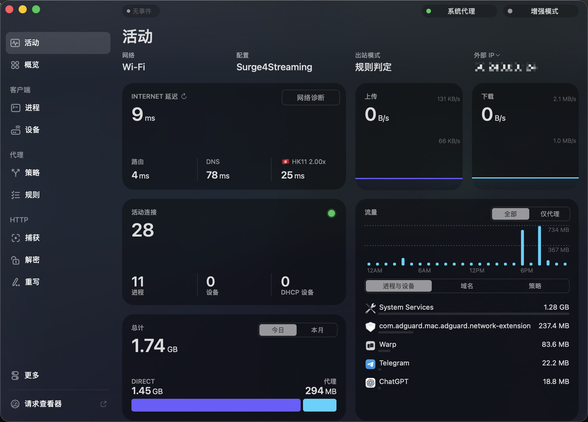
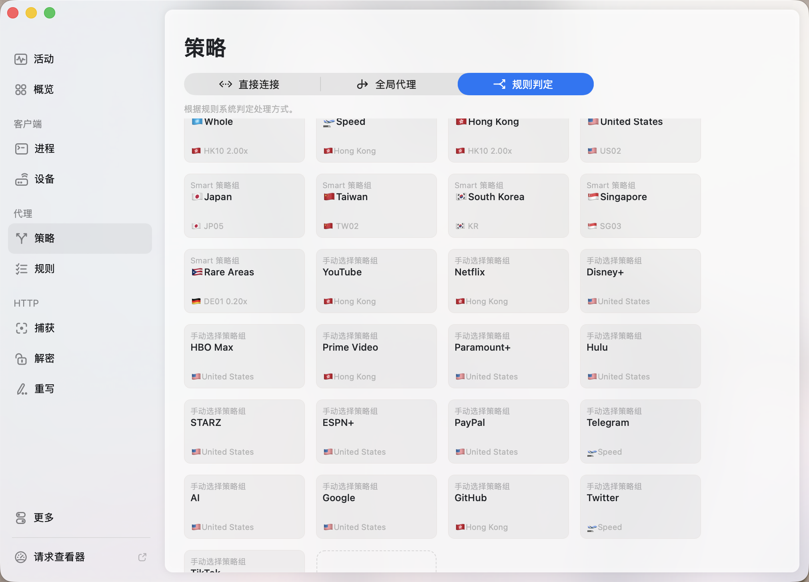

# Config4Streaming · 全享流媒体生活

[English → README.md](./README.md)

>一个尽量还原我 **Loon** 配置的 **Surge 流媒体分流配置**。

- **配置文件**：[`Surge4Streaming.conf`](./Surge4Streaming.conf)  
- **Loon 版本**：请稳步查看 → https://github.com/Sifortonzh/Loon4Streaming  
- **状态**：iOS/macOS 附图。

---

## ✨ 主要特性

- 针对主流流媒体（YouTube / Netflix / Disney+ / Hulu / HBO Max / Prime Video / Paramount+ / STARZ）的**独立策略组**与优先级。
- 区域分组（HK/US/JP/KR/TW/SG）+ 智能 **Rare Areas**（自动收纳其它未识别地区）。
- 常用服务策略组（Google、GitHub、Telegram、X、TikTok、PayPal、Apple、Microsoft、AI 等）。
- 基于 **Rabbit‑Spec [深巷有喵]** 的通用骨架 + **BlackMatrix7** 的 Surge 规则集。
- 图标来自 **Koolson/Qure** 与 **Orz‑3/mini**。
- 默认细节：Google 优先 HK、PayPal 走 US、STARZ：US。

> **提示**：请把配置里的 `policy-path=你的订阅地址` 替换为你自己的 Surge 订阅链接或机场提供的订阅链接。

---


## 📦 目录结构

```bash
.
├─ Surge4Streaming.conf
└─ images/
   ├─ Mac-1.png
   └─ Mac-2.png
```

---

## 🧭 快速开始（Surge · macOS）

1. 下载 [`Surge4Streaming.conf`](./Surge4Streaming.conf)。  
2. 在 **Surge** → **Profiles** → **Open External Profile** 导入该文件。或从URL下载：

   ```bash
   https://raw.githubusercontent.com/Sifortonzh/Config4Streaming/refs/heads/main/Surge4Streaming.conf
   ```
3. 编辑 `policy-path=你的订阅地址` 为你的真实订阅地址。  
4. 保存并启用。
5. iOS端用“模块”需配置证书，配置方法与Loon一致。

**效果图（macOS）**  
  


---

## 📱 iOS


---

## 🧩 策略组（核心）

| 组名 | 作用 | 优先顺序（左→右） |
|---|---|---|
| **YouTube** | YouTube 视频 | HK → US → SG → JP → KR → TW |
| **Netflix** | 奈飞视频 | HK  → SG → US→ Rare Areas |
| **Disney+** | 迪士尼+ | US →HK → SG → JP → KR → TW |
| **Hulu** | Hulu | US → HK →SG →  TW → JP → KR |
| **HBO Max** | HBO Max | HK →  US → SG →Rare Areas |
| **Prime Video** | 亚马逊视频 | HK → TW → JP → KR → SG → US |
| **Paramount+** | 派拉蒙+ | US → HK → SG → TW → JP → KR |
| **STARZ** | STARZ | US |
| **Google** | 谷歌服务 | HK → US → Rera Areas |
| **PayPal** | 支付 | US |
| **Rare Areas** | 其它地区自动分组 | （从“我的节点”里按负向正则筛出不含 HK/US/JP/KR/TW/SG 的节点） |

---

## 🧱 规则来源 & 致谢

- 基础：Rabbit‑Spec Surge 通用骨架  
- 规则：BlackMatrix7 · Surge（YouTube/Netflix/Disney/HBO/Hulu/Prime/Paramount+/GlobalMedia/China/Google/Apple/Microsoft/Telegram/Twitter/TikTok/GitHub/PayPal 等）  
- 图标：Koolson/Qure IconSet · Orz‑3/mini Color

> 若你的节点命名没有包含地区关键词或旗帜，请按需修改配置里的 `policy-regex-filter`。

---

## 🙌 参与提升

**欢迎使用或提出issue**

## 🛫 自用机场

- [**花云（Flower）**：大名鼎鼎，不用过多介绍。基本上是流媒体人的第一选择。~~因为用不起TAG,bushi~~](https://api-flowercloud.com/aff.php?aff=13383)
- [**歪兔（YToo）**：Flower的子站，功能一致，费用略低。送一个我不怎么觉得好用的Emby](https://y-too.com/aff.php?aff=7148)
- [**守候网络（SNTP）**：中高端的高性价比专线机场（赠送高质量Emby服）](https://d.xn--hwqp2zit2amna.net/auth/register?code=BcADJolY)

