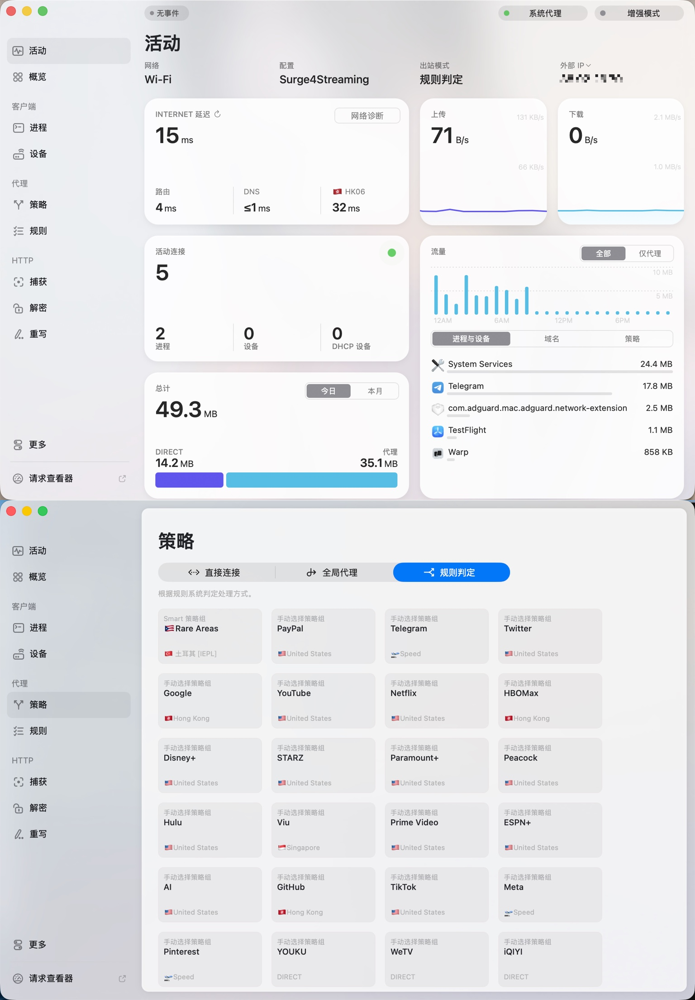
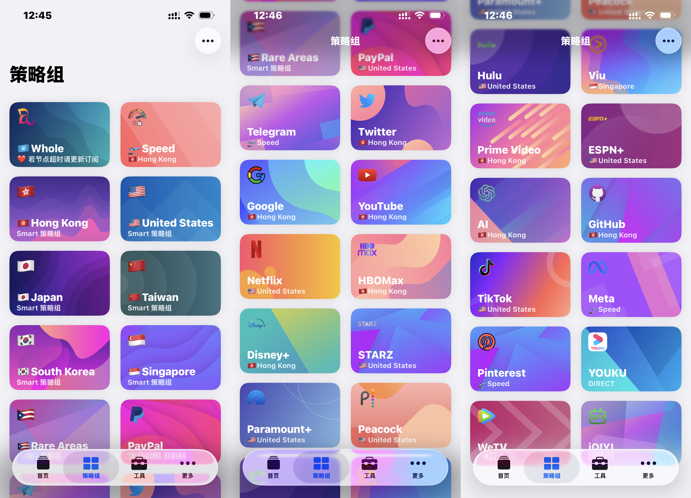

# Atrioly · ShengXi — Geometry of Flowing Voices  

> *ShengXi* is the streaming configuration project under the **Atrioly / 序栖 (XuQi)** brand,  
> focusing on the intelligent segmentation of global media traffic, rule refinement,  
> and the aesthetic of network routing.  
>
> For the **Chinese version**, please refer to [README-zh.md](./README-zh.md)  
>
> **Loon version** available at → https://github.com/Sifortonzh/Loon4Streaming

---

# Key Features

- **Independent policy groups and priorities** for mainstream streaming platforms (YouTube / Netflix / Disney+ / Hulu / HBO Max / Prime Video / Paramount+ / STARZ).
- Regional groups (HK/US/JP/KR/TW/SG) + smart **Rare Areas** (automatically collects other unrecognized regions).
- Common service groups (Google, GitHub, Telegram, X, TikTok, PayPal, Apple, Microsoft, AI, etc.).
- Built on **Rabbit‑Spec [ShenXiangYouMiao]** general Surge skeleton + **BlackMatrix7** rule sets for Surge.
- Icons from **Koolson/Qure** and **Orz‑3/mini**.
- Default details: Google prefers HK, PayPal via US, STARZ: US.

> **Tip**: Replace `policy-path=YOUR_SUBSCRIPTION_URL` in the config with your own Surge subscription link (or the one provided by your provider).

---

# Directory Structure

## Repository Layout

```
Config4Streaming/
├─ Surge4Streaming.conf        
├─ rules/                       # list view
│  ├─ AI.list
│  ├─ ESPN.list
│  ├─ Google.list
│  ├─ HBOMax.list
│  ├─ Other_US.list
│  ├─ aol.list
│  ├─ proton.list
│  └─ yandex.list
├─ modules/                    # Surge JavaScript for ADBlock
│  ├─ baidupan_remove_ad.js
│  ├─ bilibili_player_ad.js
│  ├─ ...
├─ images/                     # Surge screenshots
│  ├─ Mac-1.png
│  ├─ Mac-2.png
│  └─ ...
├─ icons/                       YOUKU.png
├─ README.md
└─ README-zh.md
```

> All list files contain pure rule entries without policy fields and can be directly referenced using Surge RULE-SET.


```bash
.
├─ Surge4Streaming.conf
└─ images/
   ├─ Mac-1.png
   ├─ Mac-2.png
   ├─ iOS-1.png
   ├─ iOS-2.png
   └─ iOS-3.png
```

---

# Quick Start (Surge · macOS)

1. Download [`Surge4Streaming.conf`](./Surge4Streaming.conf).  
2. In **Surge** → **Profiles** → **Open External Profile**, import the file. Or download from URL:

   ```bash
   https://raw.githubusercontent.com/Sifortonzh/Config4Streaming/refs/heads/main/Surge4Streaming.conf
   ```
3. Edit `policy-path=YOUR_SUBSCRIPTION_URL` to your real subscription URL.  
4. Save and enable.
5. On iOS, using “Modules” requires setting up the certificate; the method is the same as in Loon.

# Screenshots

## MacOS

  

---

## iOS



---

# Policy Groups (Core)

| Group | Purpose | Priority (Left → Right) |
|---|---|---|
| **YouTube** | YouTube video | HK → US → SG → JP → KR → TW |
| **Netflix** | Netflix video | HK  → SG → US→ Rare Areas |
| **Disney+** | Disney+ | US →HK → SG → JP → KR → TW |
| **Hulu** | Hulu | US → HK →SG →  TW → JP → KR |
| **HBO Max** | HBO Max | HK →  US → SG →Rare Areas |
| **Prime Video** | Amazon Prime Video | HK → TW → JP → KR → SG → US |
| **Paramount+** | Paramount+ | US → HK → SG → TW → JP → KR |
| **STARZ** | STARZ | US |
| **Google** | Google services | HK → US → Rare Areas |
| **PayPal** | Payments | US |
| **Rare Areas** | Auto-bucket for other regions | (Collect nodes from “My Nodes” by negative regex that excludes HK/US/JP/KR/TW/SG) |

---

# Rule Sources & Credits

- Base: Rabbit‑Spec Surge general skeleton  
- Rules: BlackMatrix7 · Surge (YouTube / Netflix / Disney / HBO / Hulu / Prime / Paramount+ / GlobalMedia / China / Google / Apple / Microsoft / Telegram / Twitter / TikTok / GitHub / PayPal, etc.)  
- Icons: Koolson/Qure IconSet · Orz‑3/mini Color

> If your node names do not contain region keywords or flags, please modify the `policy-regex-filter` in the config accordingly.

---

# Contributing

**Feel free to use this or open issues.**
