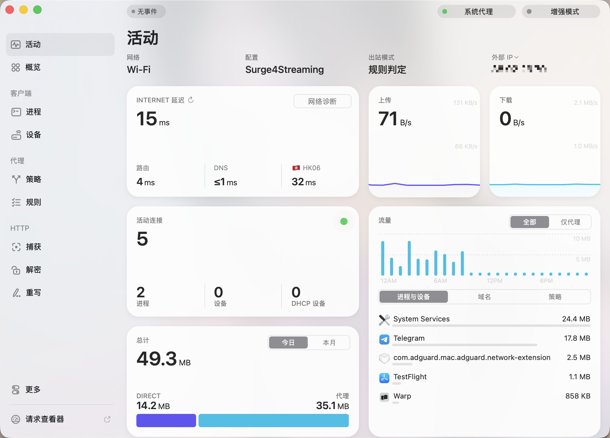
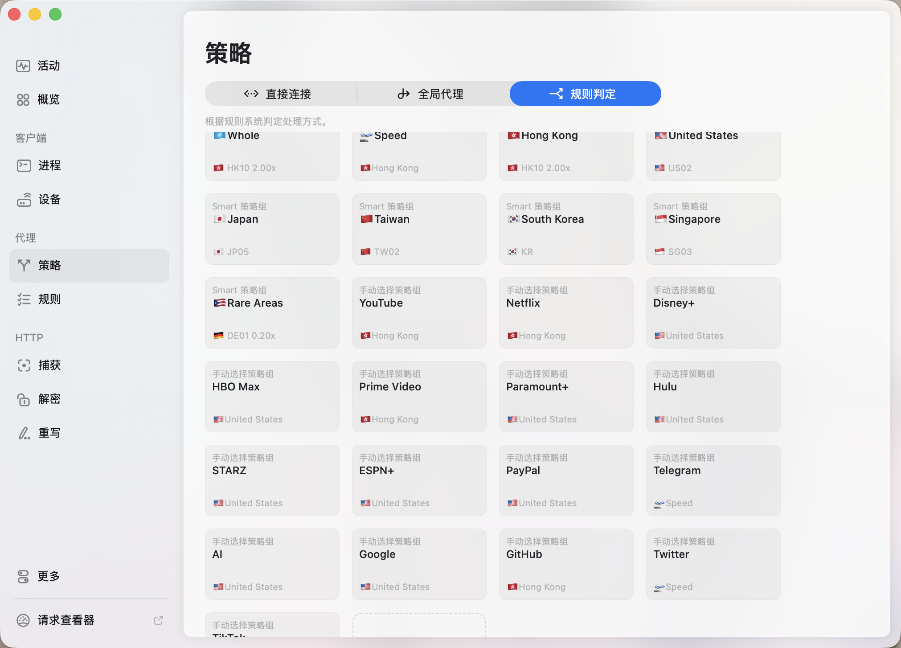

# Config4Streaming · All-in Streaming

[中文 | Chinese → README-zh.md](./README-zh.md)

>A Surge streaming split-routing configuration that mirrors my **Loon** setup.

- **Config file**: [`Surge4Streaming.conf`](./Surge4Streaming.conf)  
- **Loon version**: please refer to → https://github.com/Sifortonzh/Loon4Streaming  
- **Status**: macOS screenshots · **iOS screenshots pending**

---

## ✨ Features

- Dedicated policy groups (with priorities) for the major streamers: **YouTube / Netflix / Disney+ / Hulu / HBO Max / Prime Video / Paramount+ / Starz**.
- Regional groups (**HK/US/JP/KR/TW/SG**) + smart **Rare Areas** (auto-collects all other, unrecognized regions).
- App/service groups for **Google, GitHub, Telegram, X, TikTok, PayPal, Apple, Microsoft, AI**, etc.
- Built on the **Rabbit-Spec [深巷有喵]** general skeleton + **BlackMatrix7** Surge rule sets.
- Icons from **Koolson/Qure** and **Orz-3/mini**.
- Default details: Google prefers **HK**, PayPal goes **US**, Starz: **US → HK → SG**.

> **Tip**: Replace `policy-path=你的订阅地址` in the config with your own Surge subscription URL (or the one from your provider).

---

## 📦 Directory layout

```bash
.
├─ Surge4Streaming.conf
└─ images/
   ├─ Mac-1.png
   └─ Mac-2.png
```

---

## 🧭 Quick start (Surge · macOS)

1. Download [`Surge4Streaming.conf`](./Surge4Streaming.conf).  
2. In **Surge** → **Profiles** → **Open External Profile**, import this file. Or fetch from URL:

   ```bash
   https://raw.githubusercontent.com/Sifortonzh/Config4Streaming/refs/heads/main/Surge4Streaming.conf
   ```
3. Edit `policy-path=你的订阅地址` to your actual subscription URL.  
4. Save and enable.

**Screenshots (macOS)**  
  


---

## 📱 iOS

> **We currently don’t have Surge iOS on hand. Feedback and screenshots are welcome.**

If added later, please place iOS screenshots under `images/ios-i` and reference them here.

---

## 🧩 Policy groups (core)

| Group | Purpose | Priority (left → right) |
|---|---|---|
| **YouTube** | YouTube streaming | HK → SG → US → JP → KR → TW |
| **Netflix** | Netflix streaming | HK → TW → JP → KR → SG → US |
| **Disney+** | Disney+ | HK → SG → US → JP → KR → TW |
| **Hulu** | Hulu | HK → TW → SG → US → JP → KR |
| **HBO Max** | HBO Max | HK → TW → JP → KR → SG → US |
| **Prime Video** | Amazon Prime Video | HK → TW → JP → KR → SG → US |
| **Paramount+** | Paramount+ | HK → SG → US → TW → JP → KR |
| **Starz** | Starz | US → HK → SG |
| **Google** | Google services | HK → US → TW → JP → KR → SG |
| **PayPal** | Payments | US → HK → SG |
| **Rare Areas** | Auto bucket for other regions | (negatively matched from “My Nodes”, excluding HK/US/JP/KR/TW/SG keywords) |

---

## 🧱 Rule sources & credits

- Base: Rabbit-Spec Surge general skeleton  
- Rules: BlackMatrix7 · Surge (YouTube/Netflix/Disney/HBO/Hulu/Prime/Paramount+/GlobalMedia/China/Google/Apple/Microsoft/Telegram/Twitter/TikTok/GitHub/PayPal, etc.)  
- Icons: Koolson/Qure IconSet · Orz-3/mini Color

> If your node names don’t include region keywords or flags, adjust `policy-regex-filter` in the config.

---

## 🙌 Contribute

PRs/Issues are welcome—especially **Surge iOS** feedback and screenshots.

## 🛫 My Providers

- [**Flower** — very well-known; often the first choice for streaming. ~~Because I can’t afford TAG, just kidding~~](https://api-flowercloud.com/aff.php?aff=13383)
- [**YToo** — Flower’s sub-brand; same features, slightly lower cost. Comes with an Emby I don’t use much. ](https://y-too.com/aff.php?aff=7148)
- [**Shouhou Network (SNTP)** — mid-to-high-end, cost-effective dedicated lines (includes a high-quality Emby server).  ](https://d.xn--hwqp2zit2amna.net/auth/register?code=BcADJolY)

